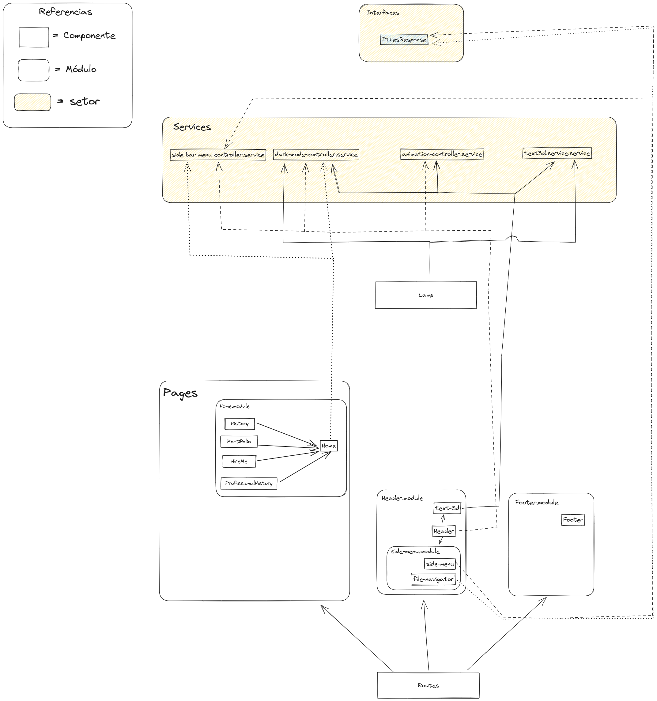

# Personal Website - Kkphoenix

[](https://angular.dev)
[](https://threejs.org/)
[](https://opensource.org/licenses/MIT)

An interactive, high-performance personal portfolio built with **Angular 19**. This project merges traditional web development with advanced 3D graphics and physics engines to create a unique, immersive user experience.



## 🚀 Features

- **3D Interactive Elements**: Integrated **Three.js** for 3D text in the header, an interactive particle background in the history section, and a mini-solar system in the footer.
- **2D Physics Engine**: An interactive "Dark Mode" toggle lamp powered by **Matter.js**.
- **Dynamic Animations**: Smooth transitions and effects using **GSAP** (GreenSock Animation Platform).
- **Second Brain Integration**: A file navigator that pulls notes and projects from a custom backend API.
- **PDF Research Hub**: A dedicated section for academic papers with a built-in PDF renderer.
- **Global State Management**: Reactive dark mode and animation control system using **RxJS**.
- **Performance Optimized**: Uses `IntersectionObserver` to pause heavy 3D renders when out of view, and `OnPush` change detection for complex components.
- **Health Dashboard**: Real-time FPS monitoring and automated test coverage visualization.

## 🛠 Tech Stack

- **Framework**: Angular 19 (Standalone Components)
- **3D/Physics**: Three.js, Matter.js
- **Animations**: GSAP
- **Styling**: SCSS (Global Variables, BEM-ish)
- **Testing**: Karma, Jasmine, Playwright, Stryker (Mutation Testing)
- **CI/CD**: Custom pipeline scripts for auditing, testing, and building.

## 📦 Installation & Setup

1. **Clone the repository**:
   ```bash
   git clone https://github.com/kkphoenix/personal-website.git
   cd personal-website/frontend-personal-website
   ```

2. **Install dependencies**:
   ```bash
   npm install
   ```

3. **Run the development server**:
   ```bash
   npm start
   ```
   Navigate to `http://localhost:4200/`.

## 🧪 Testing

The project maintains a rigorous testing standard, including unit, E2E, and mutation testing.

- **Unit Tests**: `npm test`
- **End-to-End (Playwright)**: `npm run e2e`
- **Mutation Testing (Stryker)**: `npm run mutate`
- **CI Pipeline Simulation**: `npm run pipeline`

## 📖 Documentation

Detailed documentation is available in the `docs/` folder:
- [Architecture Overview](./docs/Architecture.md)
- [Testing Strategy & Coverage](./docs/Tests_Coverage.md)
- [Project Roadmap](./docs/Todo.md)

---

Developed with ❤️ by [Kkphoenix](https://github.com/kkphoenix)
