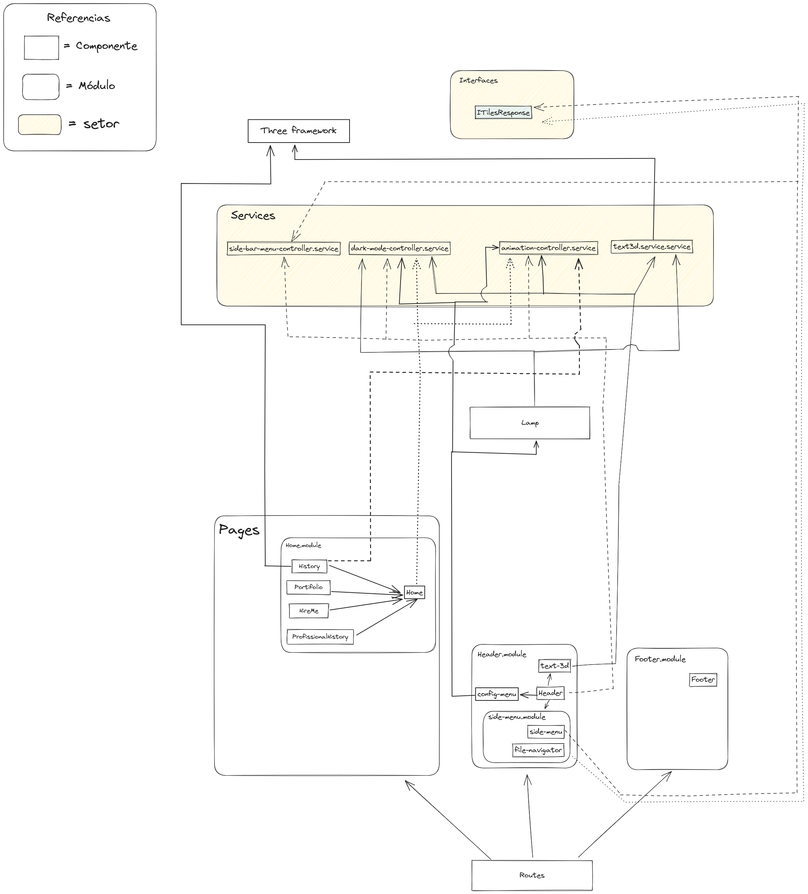

# PersonalWebsite

## Simple Notes

O + enter

## To Do

- [ ] Fazer Mobile para os componetes já existentes
- [ ] Footer com os planets
- [ ] hire-me partial
- [ ] portifolio partial
- [ ] profissional-history partial
- [ ] Change mouse. Opção para desativar isso.
- [ ] Backend Java com microservice em node para o Menu

## Completed

- [X] Perfromance No app Component
- [X] Fazer o zoom do text ser atualizado de acordo com a tela do usuário
- [X] Definir o tamanho correto do header
- [X] Diminuir o tempo de load dos componentes
- [X] Alterar animation-service para definir tempo de loading para os componentes
- [X] Testes unitários para os componentes: Certeza que os compoenntes three não estão deixando garbage

## Running unit tests

To execute unit tests with the [Karma](https://karma-runner.github.io) test runner, use the following command:

```bash
ng test
```

### Running end-to-end tests

For end-to-end (e2e) testing, run:

```bash
ng e2e
```

Angular CLI does not come with an end-to-end testing framework by default. You can choose one that suits your needs.

## Current Architeture


